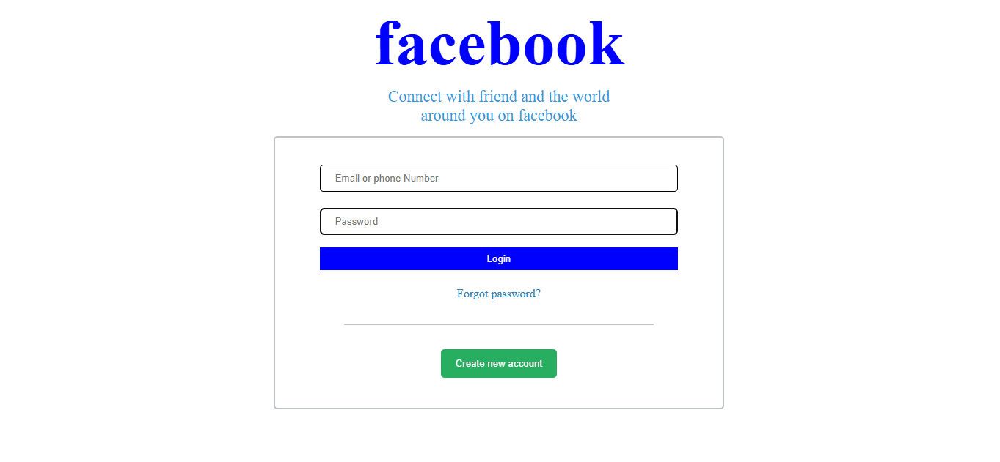

# Facebook Login Page Clone

A responsive clone of the Facebook login page built using HTML and CSS, designed to showcase front-end development skills. This project focuses on replicating the clean design, layout, and responsiveness of the official Facebook login page.

## Table of Contents
- [About the Project](#about-the-project)
- [Technologies Used](#technologies-used)
- [Features](#features)
- [Screenshots](#screenshots)

## About the Project
This project is a practice exercise to develop proficiency in HTML and CSS. It reproduces the appearance and structure of the Facebook login page, with careful attention to layout and styling for an accurate and responsive design. This project is optimized for different screen sizes to ensure the clone resembles the original page on both desktop and mobile devices.

## Technologies Used
- **HTML**: Used for structuring the page content.
- **CSS**: Used for styling and layout, ensuring responsiveness and a close match to the original design.

## Features
- **Responsive Design**: This design adjusts for desktop, tablet, and mobile screens to mimic the appearance of the actual Facebook login page.
- **Clean Layout**: Includes form fields, buttons, and a footer similar to Facebook's login page.
- **Practice Project**: Built as a learning project to enhance skills in HTML and CSS by recreating a widely recognized page layout.

## Screenshots

